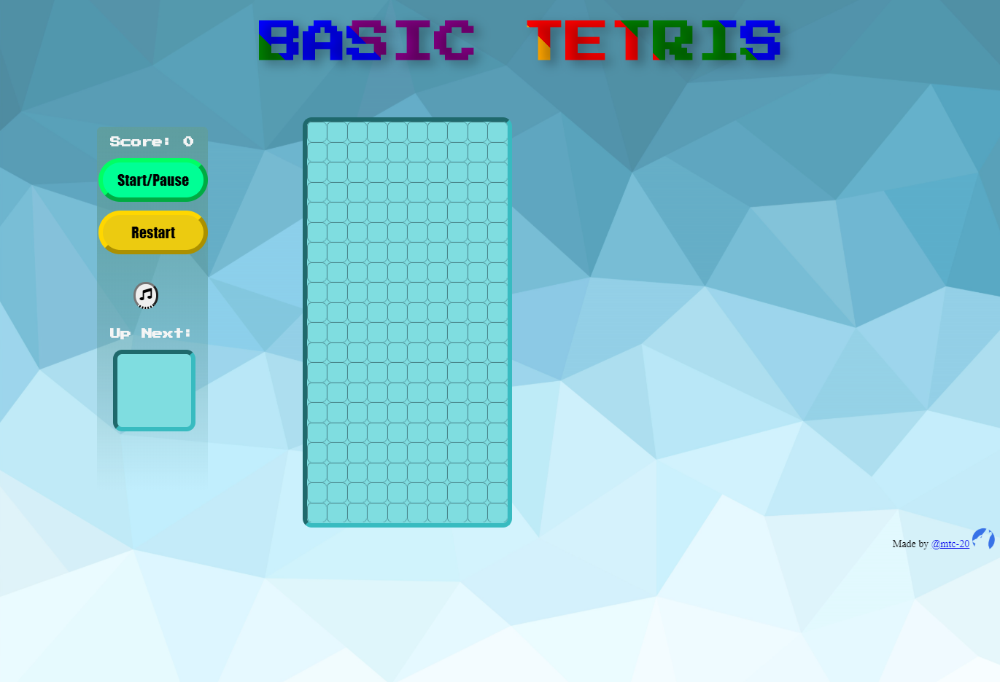

# BASIC TETRIS
**A simple Tetris game made in Javascript based on the tutorial by Ania Kubow [@kubowania](https://github.com/kubowania) for *freecodecamp*.** 

**This game/project is hosted on github.io and can be viewed here: [Basic Tetris](https://mtc-20.github.io/Tetris_js/)**

This is my first ~~project~~ time with both javascript and CSS, and I think this was a good introduction.
- The link to the *freecodecamp* article can be found [here](https://www.freecodecamp.org/news/learn-javascript-by-creating-a-tetris-game/).

- This is the link to the [YouTube video](https://www.youtube.com/watch?v=rAUn1Lom6dw)

  
 
<em>Test Logo</em> 

**CONTENTS**
- [BASIC TETRIS](#basic-tetris)
  - [Rules](#rules)
  - [Basic Controls](#basic-controls)
  - [Changes](#changes)
  - [Resources](#resources)

  
 
<em>Desktop Screenshot</em> 

## Rules

## Basic Controls
- Arrow keys to control tetromino. <kbd>Up</kbd> or <kbd>w</kbd> to rotate tetromino
- <kbd>p</kbd> to pause/resume game
- <kbd>m</kbd> to toggle music

- ~~<u>Alternatively use the buttons provided </u>~~

## Changes
- Added background music that can be paused
- Introduced some web fonts and icons
- ~~Changed the layout to have a big top-centred title and all the buttons together on the left~~ 
- Added code to increase the speed of falling tetrominoes at regular intervals
- [ ] Layout to be improved further
    - [x] Try and implement responsive (more CSS)
    - [x] Credits/Info page/menu
    - [ ] better design/colour scheme
- [ ] **Implement a working <kbd>Restart</kbd> button**
 - At the moment cannot figure out how to 'refresh' the grid without affecting the hidden (*taken*) row
- [ ] Introduce concept of levels or difficulty
- [ ] Need to clean out the code **A LOT**

## Resources
- **Fonts:** [Abril Fatface](https://fonts.google.com/specimen/Abril+Fatface), [Press Play 2P](https://fonts.google.com/specimen/Press+Start+2P?category=Serif,Sans+Serif,Display,Monospace#pairings) and others from *Google fonts*
- **Icon(s):** *[Font Awesome](https://fontawesome.com/start)*
- **Music:** [Mind Bender](https://soundimage.org/puzzle-music/) - Puzzle Music from *soundimage*
- **Logo:** Free logo created at [Logomakr](https://logomakr.com/) and converted to `.ico` using [prodraw](http://www.prodraw.net/favicon/generator.php)
- **Image(s)**: 
    - [Abstract Geometric Background Blue](https://onlyvectorbackgrounds.com/abstract-geometric-background-blue/) from *Only Vector Backgrounds*
- [CSS Cheatsheet](https://www.w3schools.com/css/default.asp)